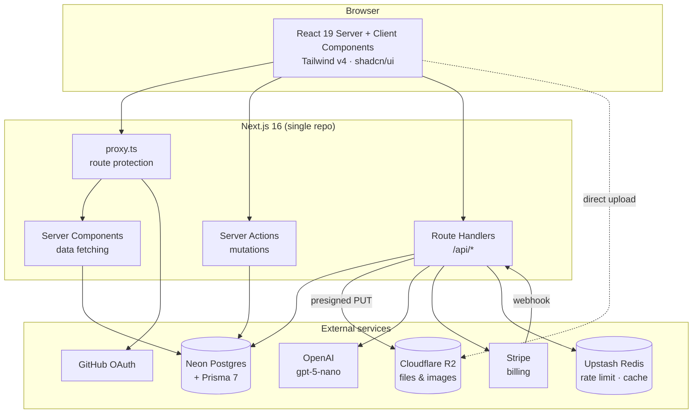
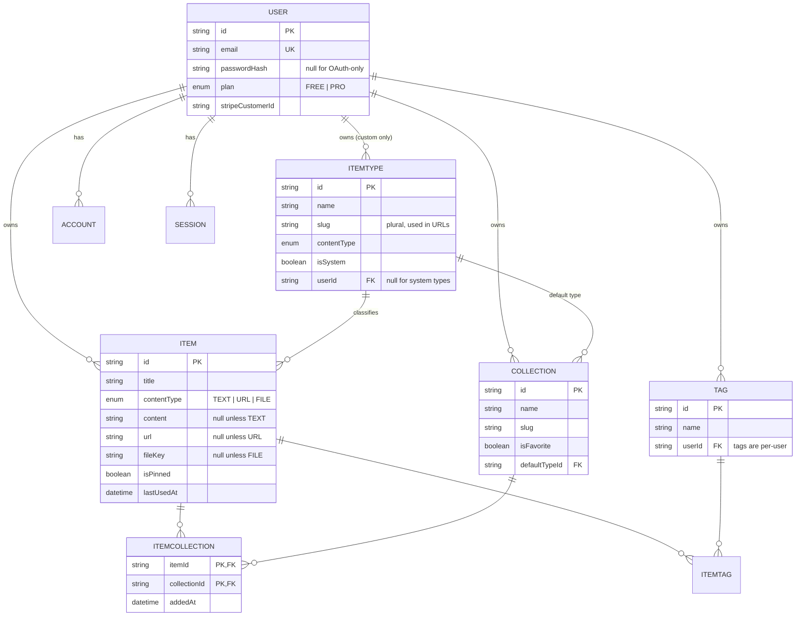
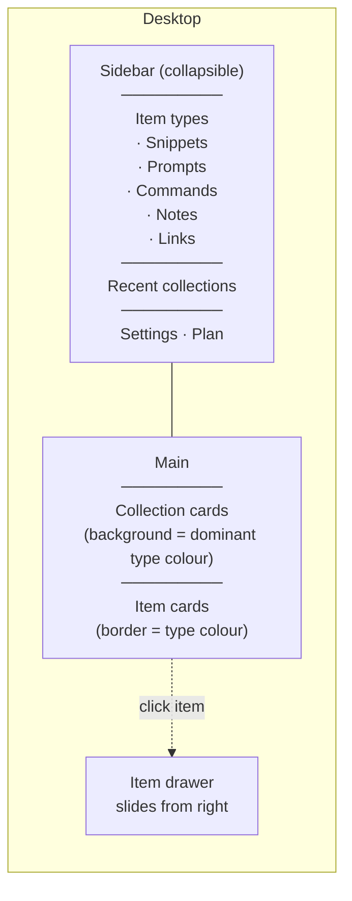

# DevStash — Project Overview

> One fast, searchable, AI-enhanced hub for everything a developer keeps scattered: snippets, prompts, commands, links, notes and context files.

|             |                                                                                                                      |
| ----------- | -------------------------------------------------------------------------------------------------------------------- |
| **Status**  | Pre-MVP / spec                                                                                                       |
| **Type**    | Freemium B2C SaaS (single-tenant per user)                                                                           |
| **Stack**   | Next.js 16 · React 19 · TypeScript · Prisma 7 · Neon Postgres · Cloudflare R2 · Auth.js v5 · Tailwind v4 + shadcn/ui |
| **Pricing** | Free / Pro $8mo · $72yr                                                                                              |

---

## Table of contents

1. [Problem & solution](#1-problem--solution)
2. [Users](#2-users)
3. [Scope](#3-scope)
4. [Feature detail](#4-feature-detail)
5. [Route map](#5-route-map)
6. [Architecture](#6-architecture)
7. [Data model](#7-data-model)
8. [Prisma schema](#8-prisma-schema)
9. [Search implementation](#9-search-implementation)
10. [Monetization & plan gating](#10-monetization--plan-gating)
11. [AI features](#11-ai-features)
12. [Design system](#12-design-system)
13. [Stack notes & gotchas](#13-stack-notes--gotchas)
14. [Open questions](#14-open-questions)
15. [Reference links](#15-reference-links)

---

## 1. Problem & solution

Developers keep their essentials scattered across too many tools:

| Where it lives today          | What it is                                  |
| ----------------------------- | ------------------------------------------- |
| VS Code / Notion              | Code snippets                               |
| ChatGPT / Claude chat history | AI prompts                                  |
| Random project folders        | Context files, `CLAUDE.md`, system messages |
| Browser bookmarks             | Useful links                                |
| `notes.txt`, Apple Notes      | Docs, explanations                          |
| `~/.bash_history`             | Terminal commands                           |
| GitHub Gists                  | Project templates, boilerplates             |

The cost is context switching, lost knowledge and inconsistent workflows. **DevStash consolidates all of it into one keyboard-fast, searchable store with AI on top.**

Positioning shorthand: _Raycast speed, Notion flexibility, developer-only scope._

---

## 2. Users

| Persona                        | Primary need                                         | Types they lean on     |
| ------------------------------ | ---------------------------------------------------- | ---------------------- |
| **Everyday developer**         | Grab a snippet/command in under 3 seconds            | snippet, command, link |
| **AI-first developer**         | Version and reuse prompts, contexts, system messages | prompt, file, note     |
| **Content creator / educator** | Store code blocks with explanations for courses      | snippet, note, image   |
| **Full-stack builder**         | Collect patterns, boilerplates, API examples         | snippet, file, link    |

All four share one behaviour worth designing around: **they capture in a hurry and retrieve under pressure.** Capture and search are the two paths that must never feel slow.

---

## 3. Scope

Cut into phases so the MVP stays shippable. _(This phasing is my suggestion — the original notes didn't sequence anything.)_

### Phase 1 — MVP

- Auth (email/password + GitHub)
- Items with the 7 system types, CRUD via drawer
- Collections + many-to-many membership
- Tags
- Search (content, title, tags, type)
- Favorites, pin, recently used
- Markdown editor + syntax highlighting
- Dark mode
- Sidebar + grid layout

### Phase 2 — Monetization

- Stripe checkout, customer portal, webhooks
- Plan limit enforcement (items, collections, uploads)
- R2 file/image upload
- Export (JSON / ZIP)

### Phase 3 — AI

- Auto-tag suggestions
- Summaries
- Explain this code
- Prompt optimizer

### Phase 4 — Later

- Custom item types
- Redis caching
- Public/shared collections
- CLI + VS Code extension _(natural extension of the value prop — worth keeping in mind while designing the API)_

---

## 4. Feature detail

### A. Items & item types

Seven system types ship first. They are immutable (`isSystem = true`, `userId = null`). Custom types come in Phase 4 and are Pro-only.

Every type resolves to one of three **content shapes**:

| Shape  | Types                          | Storage                            |
| ------ | ------------------------------ | ---------------------------------- |
| `TEXT` | snippet, prompt, note, command | `content` column                   |
| `URL`  | link                           | `url` column                       |
| `FILE` | file, image _(Pro)_            | R2 object, referenced by `fileKey` |

> **Spec fix:** the original data model had `contentType (text \| file)` — only two values — but the feature list describes three shapes including `url`. Corrected to a three-value enum below.

Items open in a **drawer**, not a page. Create and edit happen in the same drawer, invoked by a global hotkey (`Cmd/Ctrl+K` for search, `Cmd/Ctrl+N` for new item).

### B. Collections

Free-form groupings. An item can belong to many collections — a React snippet lives in both _React Patterns_ and _Interview Prep_. Membership is a join table so we can track `addedAt` and sort by "recently added to this collection".

`defaultTypeId` exists so an **empty** collection still renders a colour and so the "new item" drawer can prefill a type. Once a collection has items, the card colour is derived from its dominant type instead.

### C. Search

Postgres full-text search over title, content, description and tag names, filtered by type and collection. See [§9](#9-search-implementation).

### D. Authentication

Email/password (credentials) and GitHub OAuth. See the credentials/session caveat in [§13](#13-stack-notes--gotchas) — it constrains the session strategy.

### E. Other features

- Favorite items and collections; pin items to top
- Recently used _(requires a `lastUsedAt` column — this was missing from the original data model)_
- Import code from a file (client-side read → fills the editor; not an upload)
- Markdown editor for text types, syntax highlighting for code
- Add/remove items to/from multiple collections; view an item's collections
- Export data
- Dark mode by default

### F. AI features (Pro)

Auto-tag, summarize, explain code, optimize prompt. See [§11](#11-ai-features).

---

## 5. Route map

The original note said URLs look like `/items/snippets` — plural — while the type name is singular (`snippet`). Resolution: **types carry a `slug` field** that is the plural URL form, so display name and URL stay independent.

| Route                         | Purpose                                                                   |
| ----------------------------- | ------------------------------------------------------------------------- |
| `/`                           | Marketing landing                                                         |
| `/login`, `/register`         | Auth                                                                      |
| `/dashboard`                  | Collection grid + recent items                                            |
| `/items`                      | All items                                                                 |
| `/items/[typeSlug]`           | Filtered by type — `/items/snippets`, `/items/prompts`, `/items/commands` |
| `/items/[typeSlug]?item=[id]` | Item drawer open, deep-linkable                                           |
| `/collections`                | All collections                                                           |
| `/collections/[slug]`         | Single collection                                                         |
| `/search?q=`                  | Full search results                                                       |
| `/settings`                   | Profile, appearance, export                                               |
| `/settings/billing`           | Stripe portal entry                                                       |

| API route                     | Method           | Notes                                                              |
| ----------------------------- | ---------------- | ------------------------------------------------------------------ |
| `/api/auth/[...nextauth]`     | GET/POST         | Auth.js handlers                                                   |
| `/api/items`                  | GET/POST         | List + create _(plan limit enforced)_                              |
| `/api/items/[id]`             | GET/PATCH/DELETE |                                                                    |
| `/api/items/[id]/use`         | POST             | Bumps `lastUsedAt` / `useCount`                                    |
| `/api/collections`            | GET/POST         | _(plan limit enforced)_                                            |
| `/api/collections/[id]/items` | POST/DELETE      | Join-table mutations                                               |
| `/api/search`                 | GET              |                                                                    |
| `/api/uploads/presign`        | POST             | Returns R2 presigned PUT _(Pro)_                                   |
| `/api/ai/[action]`            | POST             | `tag` · `summarize` · `explain` · `optimize` _(Pro, rate-limited)_ |
| `/api/export`                 | GET              | JSON or ZIP                                                        |
| `/api/stripe/checkout`        | POST             |                                                                    |
| `/api/stripe/webhook`         | POST             | Signature-verified, no auth                                        |

**Mutations should prefer Server Actions** over API routes wherever the caller is our own UI; keep true API routes for webhooks, uploads, AI and anything a future CLI would call.

---

## 6. Architecture



**Note the dotted line:** file bytes go browser → R2 directly via a presigned URL. They never pass through a Next.js route handler, which sidesteps serverless body-size limits entirely.

---

## 7. Data model



### Changes from the original notes

| Change                                          | Why                                                                                                           |
| ----------------------------------------------- | ------------------------------------------------------------------------------------------------------------- |
| `contentType` is now `TEXT \| URL \| FILE`      | Original had only two values but the spec describes three shapes                                              |
| `contentType` moved onto `ItemType` too         | The type determines the shape; storing it on the type prevents a "link with file content"                     |
| Added `Item.lastUsedAt` + `useCount`            | "Recently used" was a listed feature with nowhere to store it                                                 |
| Added `Tag.userId` + `@@unique([userId, name])` | Original `Tag` was global — one user's tag rename would hit everybody                                         |
| Added `ItemTag` join table                      | Many-to-many was implied but not modelled                                                                     |
| `isPro: boolean` → `plan: enum`                 | Enum leaves room for a future Team tier; avoids a boolean that has to be re-derived from Stripe on every read |
| Added `stripePriceId`, `stripeCurrentPeriodEnd` | Needed to render "renews on X" and to grant access through the end of a cancelled period                      |
| Added `fileKey`, `fileMimeType`                 | R2 objects should be private; store the key and sign URLs on read rather than persisting a public `fileUrl`   |
| Added `slug` to `ItemType` and `Collection`     | Clean URLs without exposing cuids                                                                             |
| Added `sortOrder`, `isProOnly` to `ItemType`    | Sidebar ordering + gating file/image types without hardcoding names in app code                               |
| Added `searchVector`                            | See [§9](#9-search-implementation)                                                                            |

---

## 8. Prisma schema

Written for **Prisma 7**, which has real breaking changes from v6 — see [§13](#13-stack-notes--gotchas).

```prisma
// prisma/schema.prisma

generator client {
  provider = "prisma-client" // NOT prisma-client-js — that provider is being removed
  output   = "../src/generated/prisma"
}

datasource db {
  provider = "postgresql"
  // NOTE: `url` no longer belongs here in Prisma 7.
  // Connection strings live in prisma.config.ts (CLI) and the
  // driver adapter (runtime).
}

// ---------- Enums ----------

enum ContentType {
  TEXT
  URL
  FILE
}

enum Plan {
  FREE
  PRO
}

// ---------- Auth (Auth.js v5 adapter shape) ----------

model User {
  id            String    @id @default(cuid())
  name          String?
  email         String    @unique
  emailVerified DateTime?
  image         String?
  passwordHash  String? // null for OAuth-only accounts

  plan                   Plan      @default(FREE)
  stripeCustomerId       String?   @unique
  stripeSubscriptionId   String?   @unique
  stripePriceId          String?
  stripeCurrentPeriodEnd DateTime?

  createdAt DateTime @default(now())
  updatedAt DateTime @updatedAt

  accounts    Account[]
  sessions    Session[]
  items       Item[]
  collections Collection[]
  tags        Tag[]
  itemTypes   ItemType[] // custom types only

  @@index([stripeCustomerId])
}

model Account {
  id                String  @id @default(cuid())
  userId            String
  type              String
  provider          String
  providerAccountId String
  refresh_token     String?
  access_token      String?
  expires_at        Int?
  token_type        String?
  scope             String?
  id_token          String?
  session_state     String?

  user User @relation(fields: [userId], references: [id], onDelete: Cascade)

  @@unique([provider, providerAccountId])
  @@index([userId])
}

model Session {
  id           String   @id @default(cuid())
  sessionToken String   @unique
  userId       String
  expires      DateTime

  user User @relation(fields: [userId], references: [id], onDelete: Cascade)

  @@index([userId])
}

model VerificationToken {
  identifier String
  token      String   @unique
  expires    DateTime

  @@unique([identifier, token])
}

// ---------- Core domain ----------

model ItemType {
  id          String      @id @default(cuid())
  name        String // "Snippet"
  slug        String // "snippets" — the URL segment
  icon        String // lucide-react icon name, e.g. "Code"
  color       String // hex, e.g. "#3b82f6"
  contentType ContentType
  isSystem    Boolean     @default(false)
  isProOnly   Boolean     @default(false)
  sortOrder   Int         @default(0)

  userId String? // null for system types
  user   User?   @relation(fields: [userId], references: [id], onDelete: Cascade)

  items       Item[]
  collections Collection[] // where this is the default type

  createdAt DateTime @default(now())

  @@unique([userId, slug])
  @@index([userId])
}

model Item {
  id          String      @id @default(cuid())
  title       String
  description String?
  contentType ContentType

  content  String? @db.Text // TEXT types
  language String? // syntax highlighting hint
  url      String? // URL types

  fileKey      String? // FILE types — R2 object key, sign on read
  fileName     String?
  fileSize     Int?
  fileMimeType String?

  isFavorite Boolean   @default(false)
  isPinned   Boolean   @default(false)
  lastUsedAt DateTime?
  useCount   Int       @default(0)

  aiSummary  String? @db.Text
  aiTaggedAt DateTime?

  createdAt DateTime @default(now())
  updatedAt DateTime @updatedAt

  userId     String
  user       User     @relation(fields: [userId], references: [id], onDelete: Cascade)
  itemTypeId String
  itemType   ItemType @relation(fields: [itemTypeId], references: [id], onDelete: Restrict)

  collections ItemCollection[]
  tags        ItemTag[]

  // Managed by a Postgres trigger, not by Prisma — see §9
  // searchVector Unsupported("tsvector")?

  @@index([userId, updatedAt(sort: Desc)])
  @@index([userId, itemTypeId])
  @@index([userId, isPinned, updatedAt(sort: Desc)])
  @@index([userId, lastUsedAt(sort: Desc)])
}

model Collection {
  id          String  @id @default(cuid())
  name        String
  slug        String
  description String?
  isFavorite  Boolean @default(false)

  defaultTypeId String?
  defaultType   ItemType? @relation(fields: [defaultTypeId], references: [id], onDelete: SetNull)

  createdAt DateTime @default(now())
  updatedAt DateTime @updatedAt

  userId String
  user   User   @relation(fields: [userId], references: [id], onDelete: Cascade)

  items ItemCollection[]

  @@unique([userId, slug])
  @@index([userId, updatedAt(sort: Desc)])
}

model ItemCollection {
  itemId       String
  collectionId String
  addedAt      DateTime @default(now())

  item       Item       @relation(fields: [itemId], references: [id], onDelete: Cascade)
  collection Collection @relation(fields: [collectionId], references: [id], onDelete: Cascade)

  @@id([itemId, collectionId])
  @@index([collectionId, addedAt(sort: Desc)])
}

model Tag {
  id   String @id @default(cuid())
  name String
  slug String

  userId String
  user   User   @relation(fields: [userId], references: [id], onDelete: Cascade)

  items ItemTag[]

  createdAt DateTime @default(now())

  @@unique([userId, slug])
  @@index([userId])
}

model ItemTag {
  itemId String
  tagId  String

  item Item @relation(fields: [itemId], references: [id], onDelete: Cascade)
  tag  Tag  @relation(fields: [tagId], references: [id], onDelete: Cascade)

  @@id([itemId, tagId])
  @@index([tagId])
}
```

### Migration discipline

**Never `prisma db push`.** Every schema change goes through a migration file, run in dev then promoted to prod.

```bash
npx prisma migrate dev --name add_item_last_used_at   # dev
npx prisma migrate deploy                              # prod / CI
npx prisma generate                                    # now explicit in v7 — no postinstall hook
```

### Seeding system types

System types are data, not code — seed them in a migration so the ids are stable across environments.

| name    | slug       | contentType | color     | icon         | pro |
| ------- | ---------- | ----------- | --------- | ------------ | --- |
| Snippet | `snippets` | TEXT        | `#3b82f6` | `Code`       | —   |
| Prompt  | `prompts`  | TEXT        | `#8b5cf6` | `Sparkles`   | —   |
| Command | `commands` | TEXT        | `#f97316` | `Terminal`   | —   |
| Note    | `notes`    | TEXT        | `#fde047` | `StickyNote` | —   |
| Link    | `links`    | URL         | `#10b981` | `Link`       | —   |
| File    | `files`    | FILE        | `#6b7280` | `File`       | ✅  |
| Image   | `images`   | FILE        | `#ec4899` | `Image`      | ✅  |

⚠️ **Gotcha:** `@@unique([userId, slug])` does not prevent duplicate _system_ types, because Postgres treats `NULL` values as distinct in unique indexes. Add a partial index by hand in a migration:

```sql
CREATE UNIQUE INDEX item_type_system_slug_key
  ON "ItemType" (slug) WHERE "userId" IS NULL;
```

---

## 9. Search implementation

Postgres full-text search is enough here; don't reach for a search service at MVP.

```sql
-- migration
ALTER TABLE "Item" ADD COLUMN "searchVector" tsvector
  GENERATED ALWAYS AS (
    setweight(to_tsvector('english', coalesce(title, '')), 'A') ||
    setweight(to_tsvector('english', coalesce(description, '')), 'B') ||
    setweight(to_tsvector('english', coalesce(content, '')), 'C')
  ) STORED;

CREATE INDEX item_search_idx ON "Item" USING GIN ("searchVector");
CREATE INDEX item_title_trgm_idx ON "Item" USING GIN (title gin_trgm_ops);
```

- A **generated column** keeps the vector in sync automatically — no trigger to maintain.
- Weighting means a title match outranks a body match.
- `pg_trgm` on `title` gives fuzzy/typo tolerance for the command palette, where users type 3 characters and expect the right thing.
- Tag matching is a separate `EXISTS` clause joined on `ItemTag`, unioned into the ranking.
- Query via `prisma.$queryRaw` — Prisma's `search` filter is too limited for weighted ranking.

Debounce the palette at ~150ms and cap results at 20 with "see all results" linking to `/search?q=`.

---

## 10. Monetization & plan gating

|                      | Free                    | Pro — $8/mo or $72/yr |
| -------------------- | ----------------------- | --------------------- |
| Items                | 50                      | Unlimited             |
| Collections          | 3                       | Unlimited             |
| System types         | All except file & image | All                   |
| Custom types         | ✗                       | ✅ _(Phase 4)_        |
| File & image uploads | ✗                       | ✅                    |
| Search               | Basic                   | Full                  |
| AI auto-tagging      | ✗                       | ✅                    |
| AI summaries         | ✗                       | ✅                    |
| AI explain code      | ✗                       | ✅                    |
| Prompt optimizer     | ✗                       | ✅                    |
| Export               | JSON only _(see note)_  | JSON + ZIP with files |
| Support              | Community               | Priority              |

**Annual works out to $6/mo — a 25% discount.** Worth stating on the pricing page explicitly; it's the strongest conversion lever you have.

> **Conflict in the original notes:** "Export data as different formats" appears under general features _and_ "Export data (JSON/ZIP)" appears as Pro-only. My recommendation: give free users a plain JSON export of their own data and reserve ZIP-with-files and format variants for Pro. Data portability as a paywall generates support tickets and bad reviews, and free users can't have files anyway.

### Enforcement

Define limits in one place and check them server-side on every create path:

```ts
// src/lib/plans.ts
export const PLAN_LIMITS = {
  FREE: {
    items: 50,
    collections: 3,
    uploads: false,
    ai: false,
    maxFileSize: 0,
  },
  PRO: {
    items: Infinity,
    collections: Infinity,
    uploads: true,
    ai: true,
    maxFileSize: 25 * 1024 * 1024,
  },
} as const;
```

- **Never trust the client.** The UI hides the upload button; the API still has to reject the request.
- Store a `DEV_UNLIMITED` env flag so all users get everything during development, as the notes intend — but make it a flag, not a hardcoded `true` you'll forget to remove.
- On downgrade, don't delete anything. Put the account in read-only-over-limit mode: existing items stay visible, creation is blocked until they're under the cap.
- The Stripe webhook is the source of truth for `plan`. Handle `checkout.session.completed`, `customer.subscription.updated`, `customer.subscription.deleted`, `invoice.payment_failed`.

---

## 11. AI features

| Feature          | Input                               | Output                       | Trigger                        |
| ---------------- | ----------------------------------- | ---------------------------- | ------------------------------ |
| Auto-tag         | title + content + existing tag list | 3–5 tags, JSON array         | On save, suggested not applied |
| Summarize        | content                             | 1–2 sentence `aiSummary`     | On demand                      |
| Explain code     | content + language                  | Markdown explanation         | On demand, drawer panel        |
| Prompt optimizer | prompt content                      | Rewritten prompt + rationale | On demand, prompt types only   |

**Implementation notes**

- Model: `gpt-5-nano` — ~$0.05/M input, ~$0.40/M output, so a typical auto-tag call costs a fraction of a cent. Newer nano tiers exist now (5.4 Nano at $0.20/M input); keep the model name in an env var so you can swap without a deploy.
- Pass existing user tags into the auto-tag prompt so it reuses `react` instead of inventing `reactjs`, `React.js`, `react-hooks`.
- Force structured output (JSON mode / response schema) — never regex the reply.
- **Rate limit per user**, not per IP. This is the one endpoint where a Pro subscriber can cost you real money. Upstash Redis is the cheap answer and gives you the "Maybe Redis" line in the notes a concrete purpose.
- Cache by content hash: re-explaining unchanged code should be free.
- Stream `explain` and `optimize` responses; they're long enough that a spinner feels broken.
- Truncate input — a 500KB context file should not be sent whole.

---

## 12. Design system

**References:** Notion (structure), Linear (density and speed), Raycast (command palette).

- Dark mode by default, light optional. Persist to `localStorage` + `prefers-color-scheme` fallback, set before paint to avoid a flash.
- Clean typography, generous whitespace, subtle borders and shadows.
- Syntax highlighting: **Shiki** over Prism — it uses real TextMate grammars, renders on the server, and ships zero runtime JS for static blocks.

### Type colours & icons

Lucide icon names, matching `ItemType.icon`.

| Type    | Colour            | Swatch | Icon         |
| ------- | ----------------- | ------ | ------------ |
| Snippet | `#3b82f6` blue    | 🟦     | `Code`       |
| Prompt  | `#8b5cf6` purple  | 🟪     | `Sparkles`   |
| Command | `#f97316` orange  | 🟧     | `Terminal`   |
| Note    | `#fde047` yellow  | 🟨     | `StickyNote` |
| File    | `#6b7280` gray    | ⬜     | `File`       |
| Image   | `#ec4899` pink    | 🟥     | `Image`      |
| Link    | `#10b981` emerald | 🟩     | `Link`       |

⚠️ `#fde047` (note yellow) fails WCAG AA against white text and is low-contrast on light backgrounds. Define each colour as a **pair** — a saturated version for dark mode and a darker version for light mode — rather than one hex used everywhere. Tailwind v4's `@theme` block is the right home for this.

### Layout



- **Collection cards:** background colour derived from the type the collection holds most of, falling back to `defaultTypeId` when empty.
- **Item cards:** border colour by type. Keeps the grid calm while still colour-coded.
- **Drawer:** every item opens here, from anywhere. Deep-linkable via `?item=id` so it survives refresh and can be shared.
- **Responsive:** desktop-first, mobile usable. Sidebar becomes a drawer under `md`.

### Micro-interactions

Smooth transitions · card hover states · toast notifications (sonner) · loading skeletons · **optimistic updates** for favorite/pin/copy — those must feel instant, and a round-trip will make them feel broken.

One thing worth adding: a **copy button on every snippet card** that doesn't require opening the drawer. It's the single most common action in a tool like this.

### Screenshots

Refer to the screenshots in the `@context/screenshots` directory as a base for the dashboard UI. It does not need to be pixel-perfect, but should give a good idea of the layout and visual elements.

---

## 13. Stack notes & gotchas

Everything below is a real breaking change or constraint in the chosen versions, current as of August 2026.

### Prisma 7

<cite index="9-1">Prisma 7 now ships as an ES module, so `type: "module"` goes in `package.json` and tsconfig needs `"module": "ESNext"` with `"moduleResolution": "bundler"`. The way you create a Prisma Client has also changed — a driver adapter is now required for every database.</cite>

<cite index="6-1">The post-install hook that auto-generated the client is gone, so `prisma generate` has to be called explicitly, and drivers are no longer embedded — for Postgres you install `@prisma/adapter-pg` and pass it when constructing the client.</cite>

<cite index="5-1">Connection URLs no longer belong in the `datasource` block; putting one there now throws a P1012 validation error telling you to move it to `prisma.config.ts`.</cite>

```ts
// prisma.config.ts
import "dotenv/config";
import { defineConfig, env } from "prisma/config";

export default defineConfig({
  schema: "prisma/schema.prisma",
  migrations: { path: "prisma/migrations" },
  datasource: {
    url: env("DIRECT_DATABASE_URL"), // Neon direct, not pooled — migrations need it
  },
});
```

```ts
// src/lib/db.ts
import { PrismaClient } from "@/generated/prisma/client";
import { PrismaPg } from "@prisma/adapter-pg";

const adapter = new PrismaPg({ connectionString: process.env.DATABASE_URL });

export const db = globalThis.prisma ?? new PrismaClient({ adapter });
if (process.env.NODE_ENV !== "production") globalThis.prisma = db;
```

<cite index="6-1">Prisma also no longer auto-loads environment variables when the CLI runs</cite> — hence the explicit `dotenv/config` import above.

Use Neon's **pooled** connection string at runtime and the **direct** one for migrations.

### Next.js 16

<cite index="12-1">`middleware.ts` has been replaced by `proxy.ts` to make the network boundary explicit.</cite> <cite index="13-1">The proxy runs on the Node.js runtime only — edge is not supported there and the runtime isn't configurable.</cite> <cite index="17-1">`middleware.ts` still works but is deprecated.</cite>

<cite index="18-1">Caching is now explicit rather than implicit: where 13–15 cached `fetch` by default, 16 caches nothing unless you mark it with `use cache`.</cite> Enable via `cacheComponents: true` in `next.config.ts`. For DevStash this is mostly good news — the data is user-private and shouldn't be cached anyway — but it means you must opt in deliberately for the marketing pages.

### Auth.js v5

Three things to know:

1. <cite index="23-1">v5 is stable and production-ready, but Auth.js has been in maintenance mode since early 2026 — security updates only, no new features, with active development moved to Better Auth.</cite> Since you're greenfield, **it's worth 30 minutes evaluating Better Auth before committing.** It has first-class email/password, which is exactly the part Auth.js makes you build yourself.
2. <cite index="25-1">The credentials provider requires you to write your own password hashing and verification — Auth.js deliberately won't do it for you.</cite> Use argon2id or bcrypt with cost ≥ 12. Also note the credentials provider only works with **JWT sessions**, not database sessions, so the `Session` model above will sit unused unless you mix strategies.
3. <cite index="21-1">Importing `auth.ts` inside the proxy pulls in the Prisma adapter and breaks, so the config must be split — import a lean `auth.config.ts` in the proxy and keep the adapter in `auth.ts`.</cite>

**Security note:** <cite index="21-1">CVE-2025-29927 showed that middleware-only session protection in Next.js can be bypassed by spoofing a header.</cite> Treat `proxy.ts` as a redirect convenience only. **Every server action and route handler must independently call `auth()` and verify ownership** — including checking that the `userId` on the row matches the session. That ownership check is the single most important line of code in this app.

### Cloudflare R2

- Keep the bucket **private**. Upload via presigned PUT, read via presigned GET with a short TTL, or put a Worker in front for signed access.
- Validate MIME type and size **server-side when issuing the presign**, not after upload.
- Store `fileKey`, derive URLs. Persisted URLs go stale the moment you change buckets or add a CDN.
- Deleting an item must delete the R2 object — Postgres cascades won't do that for you. Either delete inline or write a `PendingDeletion` row swept by a cron.

### Rate limiting

Beyond AI: put a limit on registration, password login and the presign endpoint too. Upstash Ratelimit handles all of these with the same Redis instance.

---

## 14. Open questions

Things the notes don't settle. None block starting, but each will bite later if left implicit.

1. **Item ↔ collection cascade.** If a collection is deleted, do its items survive? (Recommendation: yes — collections are labels, not folders. Make that explicit in the delete confirmation.)
2. **Does `defaultTypeId` restrict what can go in a collection, or is it only a colour/prefill hint?** The schema above assumes hint-only.
3. **What is "basic search" for free users?** Title-only? No tag filter? It needs a concrete definition or it becomes an accidental feature.
4. **Versioning for prompts.** The AI-first persona iterates on prompts constantly. No history means they'll paste v1 and v2 as separate items and lose the thread. Worth a `PromptVersion` table eventually — flagging now because it affects the `Item` model if added later.
5. **Import path.** "Import code from a file" is listed, but bulk import — from a Gist, a folder, a JSON export — is the thing that gets a new user past the empty state. Consider it for Phase 2; it's also the strongest migration story away from Gists.
6. **Soft delete / trash.** Hard deletes on a knowledge store are unforgiving. A `deletedAt` column now is far cheaper than a restore feature later.
7. **Custom types with a `contentType`.** When custom types ship, users will want a custom FILE type. Make sure the gating logic keys off `contentType` and `isProOnly`, not type names.
8. **Empty states.** Every list view needs one. This is where the product either explains itself or loses the user.

---

## 15. Reference links

**Framework & data**

- [Next.js 16 release notes](https://nextjs.org/blog/next-16) · [Upgrade guide](https://nextjs.org/docs/app/guides/upgrading/version-16)
- [Prisma 7 upgrade guide](https://www.prisma.io/docs/guides/upgrade-prisma-orm/v7) · [Prisma changelog](https://www.prisma.io/changelog)
- [Prisma 7 AMA — reasoning behind the changes](https://www.prisma.io/blog/prisma-7-ama-clearing-up-the-why-behind-the-changes)
- [Neon docs](https://neon.tech/docs) · [Neon + Prisma guide](https://neon.tech/docs/guides/prisma)

**Auth**

- [Auth.js v5 migration guide](https://authjs.dev/getting-started/migrating-to-v5)
- [Auth.js Prisma adapter](https://authjs.dev/getting-started/adapters/prisma)
- [Better Auth](https://www.better-auth.com) — the alternative worth 30 minutes
- [Next.js auth library comparison, 2026](https://blog.logrocket.com/best-auth-library-nextjs-2026/)

**UI**

- [Tailwind CSS v4](https://tailwindcss.com/docs) · [shadcn/ui](https://ui.shadcn.com) · [Lucide icons](https://lucide.dev/icons)
- [Shiki](https://shiki.style) — server-rendered syntax highlighting
- [sonner](https://sonner.emilkowal.ski) — toasts · [cmdk](https://cmdk.paco.me) — command palette

**Infra**

- [Cloudflare R2 docs](https://developers.cloudflare.com/r2/) · [Presigned URLs](https://developers.cloudflare.com/r2/api/s3/presigned-urls/)
- [Stripe subscriptions](https://docs.stripe.com/billing/subscriptions/overview) · [Webhook best practices](https://docs.stripe.com/webhooks)
- [Upstash Ratelimit](https://upstash.com/docs/redis/sdks/ratelimit-ts/overview)
- [OpenAI API pricing](https://openai.com/api/pricing/) · [Structured outputs](https://platform.openai.com/docs/guides/structured-outputs)

**Postgres search**

- [PostgreSQL full-text search](https://www.postgresql.org/docs/current/textsearch.html) · [pg_trgm](https://www.postgresql.org/docs/current/pgtrgm.html)
